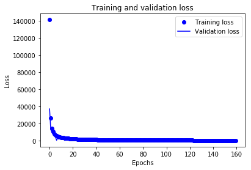

# Kaggle Data Challenge

The goal of this Kaggle data challenge is to classify primary sites in histopathology images. In my approach, I have trained a convolutional neural network (CNN) for this data challenge using the Keras framework on Google Colab.

The first step in my approach is to analyze the data in order to determine its dimensions and the number of classes. From this, I found that the images are of size (168, 308, 3) and there are 760 images labelled as one of the 20 classes to classify from.

After this, I have normalized the data, such that each pixel ranges between [0, 1] instead of [0, 255]. Then, the data is split such that 80% of the data is used for training and 20% is used for validation. Next, I performed data augmentation on the training data by flipping the images horizontally and vertically. This was done because not a lot of samples were given for training.

For the network, I have decided to use a CNN architecture with 3 convolution and max pooling layers. A leaky ReLU was used as the activation function instead of the normal ReLU in these layers. This is because when large gradients flow through the ReLU neuron, it can cause weights to update in a way that it will be difficult for the neuron to activate on future data points again. Leaky ReLU addresses this problem by introducing a small negative slope instead of 0. Convolutional kernel sizes of 4x4 were used, as this showed to be able to achieve a higher accuracy, as compared to when kernels of size 3x3 were used. Pooling kernels with size 2x2 were used. Specifically, for the first convolutional layer, a L2 activity regularizer was added to penalize large weights. After the convolutional layers, the output was flattened and passed into two layers with 64 densely connected neurons with a leaky ReLU activation function and a dropout of 0.4 to prevent large weights. A final dense layer with 20 neurons and a softmax activation function was added so that the model can perform classification on the 20 classes.

Next, the hyperparameters were set in order to control the learning process. A batch size of 100 images trained for 160 epochs with 10 steps were epoch were found to be the most effective. Categorical cross entropy was used as the loss function, since there are multiple classes that are categorical. The Adam with default parameters was used as the optimizer. The learning rate was also kept at the default of 0.001.
Several built-in callback functions in Keras were examined. These included early stopping, reduce learning rate loss, and model checkpoint callbacks. The early stopping and reduce learning rate loss callbacks were investigated for its effectiveness but were abandoned, since they did not lead to higher accuracies upon experimentation. The model checkpoint callback was used in order to save the model weights at each epoch. After that, the model was trained using the specified parameters. Each epoch took around 6 seconds, which lead to an overall training time for approximately 16 minutes. The training and validation accuracy and loss per epoch were plotted. These are shown below in the figures below.

By manual inspection of the training and validation accuracies and loss over each epoch, the best model was selected to be that at epoch 158, where the training loss is 86.47, the testing loss is 82.65, the training accuracy is 1.0, and the testing accuracy is 0.94. This model was selected because the training and testing accuracies and losses are quite similar, suggesting that the model did not significantly overfit.
